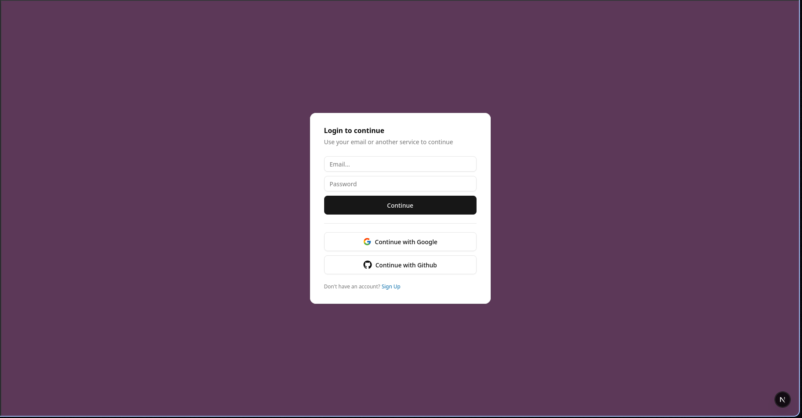
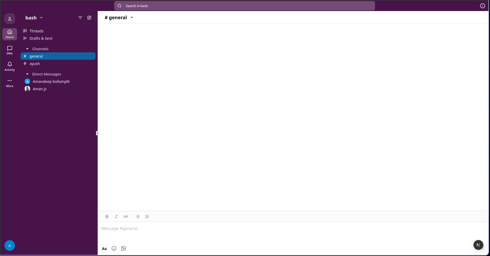
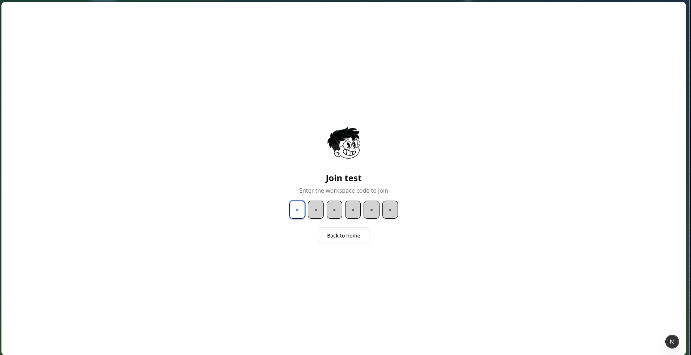
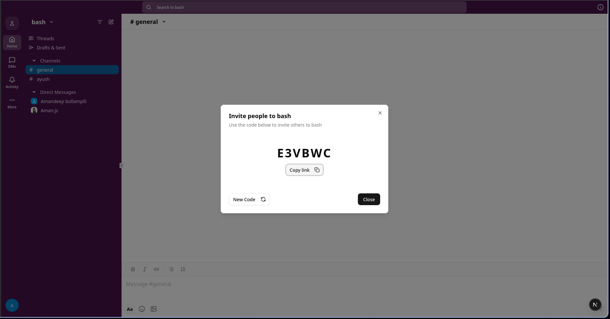

# Real-Time Workspace Collaboration App (Slack Clone)

A modern Slack-style collaboration platform built using **Next.js**, **Convex**, **Convex Auth**, and **shadcn/ui**.

This project demonstrates workspace-based collaboration features including authentication, workspace creation, and member invitations with a scalable frontend architecture.

---

## 🚀 Features

- Secure authentication using Convex Auth
- Create and manage workspaces
- Invite members to workspaces
- Workspace switching support
- Channel-style collaboration layout
- Responsive modern UI using shadcn/ui
- Built with Next.js App Router architecture
- Real-time backend integration using Convex

---

## 🧰 Tech Stack

### Frontend
- Next.js (App Router)
- React.js
- Tailwind CSS
- shadcn/ui

### Backend
- Convex Database
- Convex Auth

### Tools
- Git & GitHub
- Vercel (recommended deployment)

---

## 📸 Screenshots

### Login Page


### Workspace Home


### Invite Members


### Invite Modal


---

## ⚙️ Installation

Clone the repository:

```bash
git clone https://github.com/amanyxdev/Slack-clone.git
